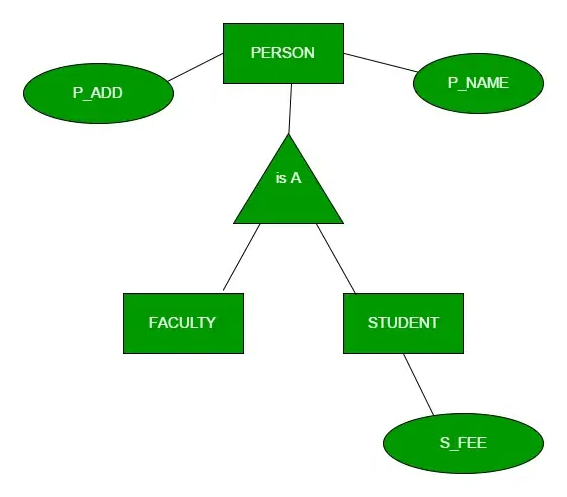
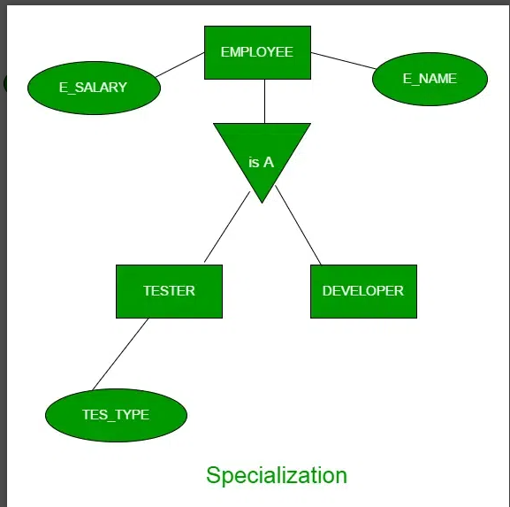
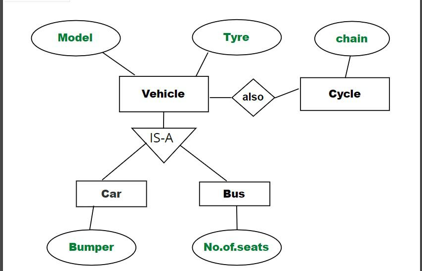
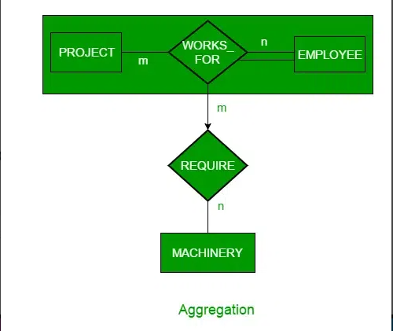

**Generalization, Specialization & Aggregation - Revision Notes**

###  Purpose

To simplify complex ER models and support **data abstraction**, the concepts of **Generalization**, **Specialization**, and **Aggregation** are used.

***

### 1. Generalization

-   **Definition**: Combining two or more entity sets with common attributes into a higher-level entity.
    
-   **Approach**: Bottom-Up
    
-   **Use Case**: Reduces duplication of attributes
    
-   **Example**: `STUDENT` and `FACULTY` → generalized into `PERSON`
    
    -   Common attributes like `P_NAME`, `P_ADD` go to `PERSON`
        
    -   Specific attributes like `S_FEE` stay in `STUDENT`
 
       
        

***

### 2. Specialization

-   **Definition**: Dividing a high-level entity set into two or more specialized entity sets.
    
-   **Approach**: Top-Down
    
-   **Use Case**: To model specific behavior of sub-entities
    
-   **Example**: `EMPLOYEE` specialized into `DEVELOPER`, `TESTER`
    
    -   Common attributes: `E_NAME`, `E_SAL` remain in `EMPLOYEE`
        
    -   Specialized attribute: `TEST_TYPE` exists only in `TESTER`
 
         
        

      ###  Inheritance in ER Model

      #### Attribute Inheritance:

    -   Sub-entities inherit attributes of super-entities
    
    -   Example: `CAR` inherits `Model` from `VEHICLE`
    

    #### Participation Inheritance:

    -   Sub-entities inherit **participation constraints** of the parent entity
    
    -   **Note**: Relationships themselves are not inherited
    
    -   Example: If `VEHICLE` participates in a relation with `CYCLE`, `CAR` (as a subclass of `VEHICLE`) doesn’t inherit that relationship unless explicitly defined
     

***

  ### 3. Aggregation

-   **Problem**: ER diagrams can’t directly represent a relationship between an entity and another relationship
    
-   **Solution**: **Aggregation** groups entities and their relationship into a higher-level abstract entity
    

**Example**:

-   `EMPLOYEE` works on `PROJECT` → `WORKS_FOR` relationship
    
-   `MACHINERY` is required for a project
    
-   Aggregation groups `EMPLOYEE + PROJECT + WORKS_FOR` into one entity
    
-   Then `REQUIRE` relationship connects this aggregated unit to `MACHINERY`
    

***

### Representing Aggregation in Schema

-   Include:
    
    -   Primary key of the aggregated relationship
        
    -   Primary key of the related entity set
        
    -   Any descriptive attributes
         

***

These advanced features help manage large and complex database models with improved clarity and abstraction.