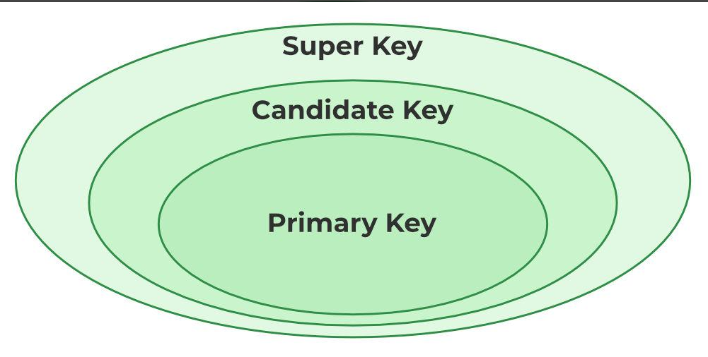
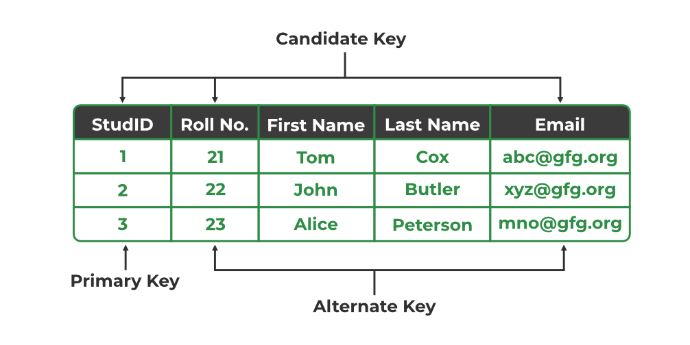
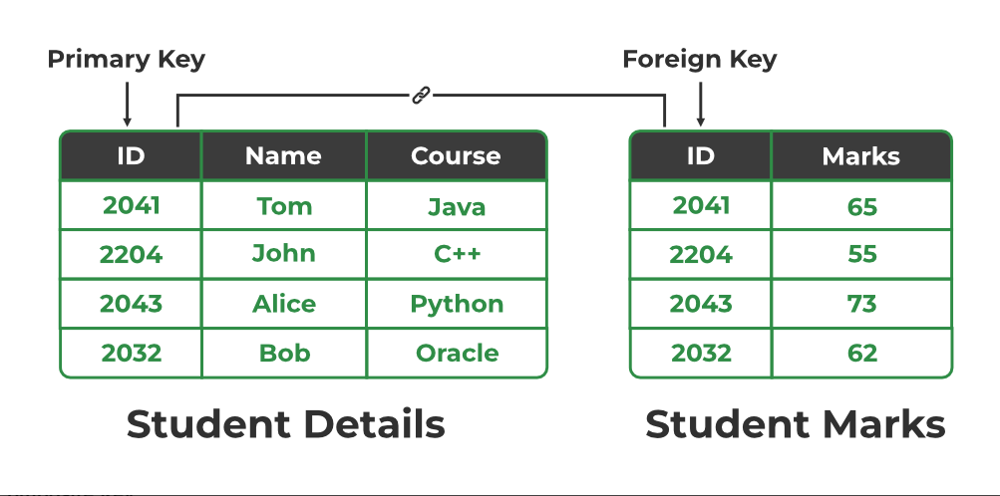
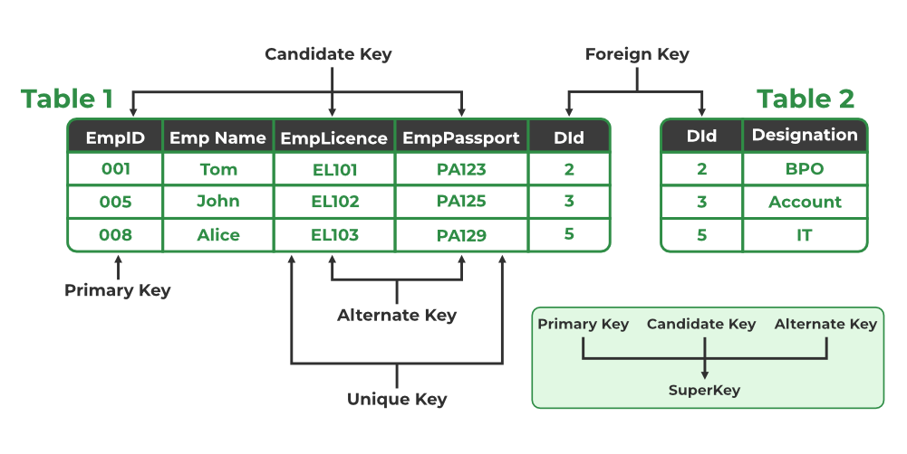

## 🔑 1. **Super Key**

**Definition:**  
A super key is any combination of attributes that **can uniquely identify a row** in a table. It **may include extra attributes** that are not necessary for uniqueness.

### Example:

Table: STUDENT
| ****STUD_NO**** | ****SNAME**** | ****ADDRESS**** | ****PHONE**** |
| :---: | :---: | :---: | :---: |
| 1   | Shyam | Delhi | 123456789 |
| 2   | Rakesh | Kolkata | 223365796 |
| 3   | Suraj | Delhi | 175468965 |

### Possible Super Keys:

-   `{STUD_NO}`
    
-   `{STUD_NO, SNAME}`
    
-   `{STUD_NO, PHONE}`
    
-   `{STUD_NO, SNAME, PHONE}`
    

> All these combinations can uniquely identify a row, even though some have extra info.

***

## 🗝️ 2. **Candidate Key**

**Definition:**  
A candidate key is a **minimal super key**. It means it's just enough to uniquely identify a row and **no extra attribute** is allowed.

### From previous table:

-   `{STUD_NO}` ✅ — Uniquely identifies, minimal → **Candidate key**
    
-   `{PHONE}` ✅ — Also unique → **Candidate key**
    
-   `{STUD_NO, SNAME}` ❌ — Super key but **not minimal** → Not a candidate key
    

> So, here we have **two candidate keys**: `{STUD_NO}` and `{PHONE}`

***

## 🔐 3. **Primary Key**

**Definition:**  
A primary key is one of the candidate keys **chosen** to uniquely identify records in a table. It **must not be NULL** and **must be unique**.

### From the STUDENT table:

You can choose either:

-   `{STUD_NO}` ✅ as Primary Key  
    or
    
-   `{PHONE}` ✅ as Primary Key

 
    

> But only **one** can be primary. Suppose we choose `STUD_NO`.

***

## 🔁 4. **Alternate Key**

**Definition:**  
An alternate key is a candidate key **not chosen** as the primary key.

From earlier:

-   Candidate Keys: `{STUD_NO}`, `{PHONE}`
    
-   Primary Key Chosen: `{STUD_NO}`
    
-   ⇒ Alternate Key: `{PHONE}`

 
    

***

## 🔗 5. **Foreign Key**

**Definition:**  
A foreign key is an attribute in one table that **references a primary key in another table**, helping link records.

### Example:

sql

CopyEdit

| ****STUD_NO**** | ****TEACHER_NO**** | ****COURSE_NO**** |
| :---: | :---: | :---: |
| 1   | 005 | C001 |
| 2   | 056 | C005 |

-   `STUDENT_COURSE.STUD_NO` is a **foreign key** referencing `STUDENT.STUD_NO` (primary key).
    
-   `STUD_NO` can repeat in `STUDENT_COURSE` — it’s fine.
    
-   It enforces that every STUD_NO in `STUDENT_COURSE` must exist in `STUDENT`.
     

***

## 🧩 6. **Composite Key**

**Definition:**  
A composite key is a **combination of two or more attributes** that **together uniquely identify a row**.

### Example:

 
